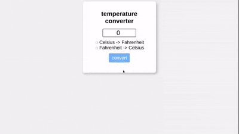

# Temperature converter
a simple temperature converter that converts temperatures from Celsius or Fahrenheit, both ways using javascript.

**Link to project:** https://iwnelion.github.io/temperature-converter/

## How It's Made:

**Tech used:** HTML, CSS, JavaScript.

starting with a simple form, a js function takes the user's input in the textbox and does the conversion. after entering a number, the user chooses between two radio buttons: one for conversion to Fahrenheit and one for Celsius. after clicking the convert button, the function is fired and the result is displayed in a paragraph under the button. if the user clicks on the button without choosing a radio button, a message will appear in the result paragraph, reminding them to pick a unit.

## Examples:
Take a look at these couple examples that I have in my own portfolio:

**My personal website:** https://github.com/iwnelion/website, https://iwnelion.github.io/website/

**Etch a sketch board:** https://github.com/iwnelion/project_etch_a_sketch, https://iwnelion.github.io/project_etch_a_sketch/

**Curry Symphony:** https://github.com/iwnelion/currysymphony, https://iwnelion.github.io/currysymphony/
